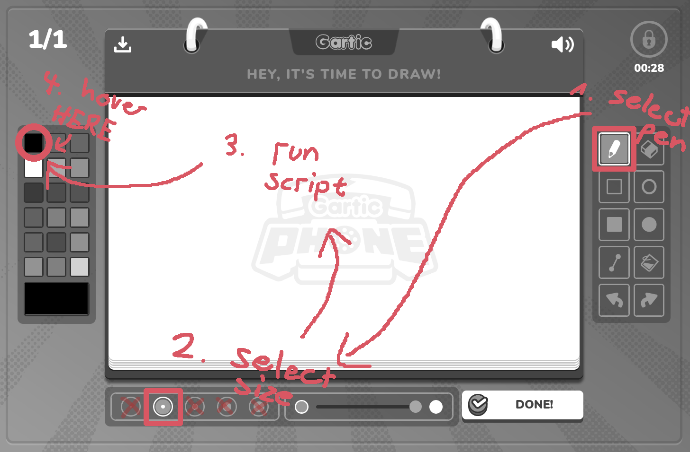
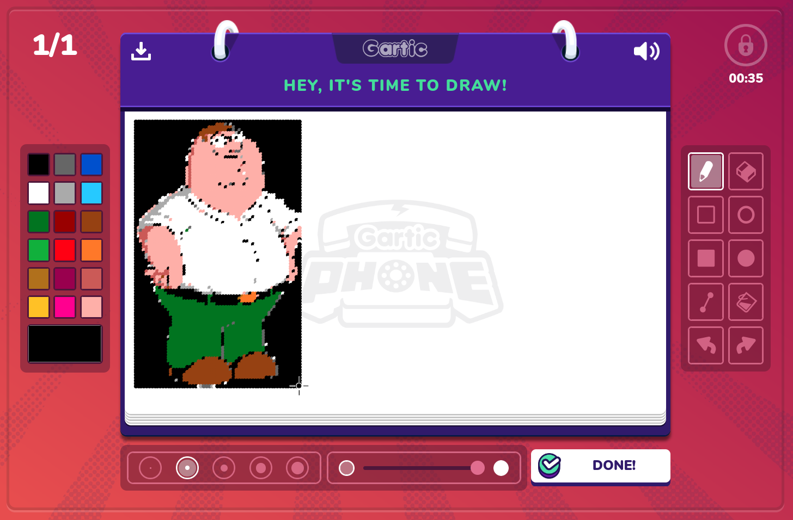

# gartic-cheat

A funny little tool that allows you to automatically print images into Gartic Phone.

### Usage:

First, make sure you have Python and `pynput` installed:
(After installing python)
```
pip install pynput
```

In Gartic Phone, select the pen tool and the second smallest pen size.
Then run `main.py`, passing a local path or a URL to the image as the paramter:
```
python main.py https://static.wikia.nocookie.net/familyguyfanon/images/c/c2/Peter_Griffin.png
```
Afterwards quickly tab into Gartic Phone and position your mouse over the black square in the color palette on the left:



Then simply watch the magic happen:



In the case that your browser window starts to freeze for longer durations of time,
you may need to open up `main.py` and change the definition of `DRAW_SPEED`:
```py
# RAISE THIS NUMBER TO MAKE DRAWING SLOWER
# LOWER IT TO MAKE IT FASTER
# (Some browsers might not be able to deal with lower numbers)
DRAW_SPEED = 0.006
```
Changing it to something like `0.0075` or even `0.01` might fix the issue,
but will make drawing slower:
```py
DRAW_SPEED = 0.0075
```

### Bonus

Here are another few links you can try:
- `https://i.scdn.co/image/ab67616d00001e029b49d58213555e4a0fa2f6f2`
- `https://cdn.mos.cms.futurecdn.net/tv4A6KsVocJQZRPReyPXWU-1200-80.jpg`
- `https://cdn.prgloo.com/media/bd096a22a9824d758a0473c501a1d710.jpg`
- `https://live.staticflickr.com/65535/51802420172_e7e38d1485_b.jpg`
- `https://i1.sndcdn.com/artworks-Uii8SMJvNPxy8ePA-romBoQ-t1080x1080.jpg`